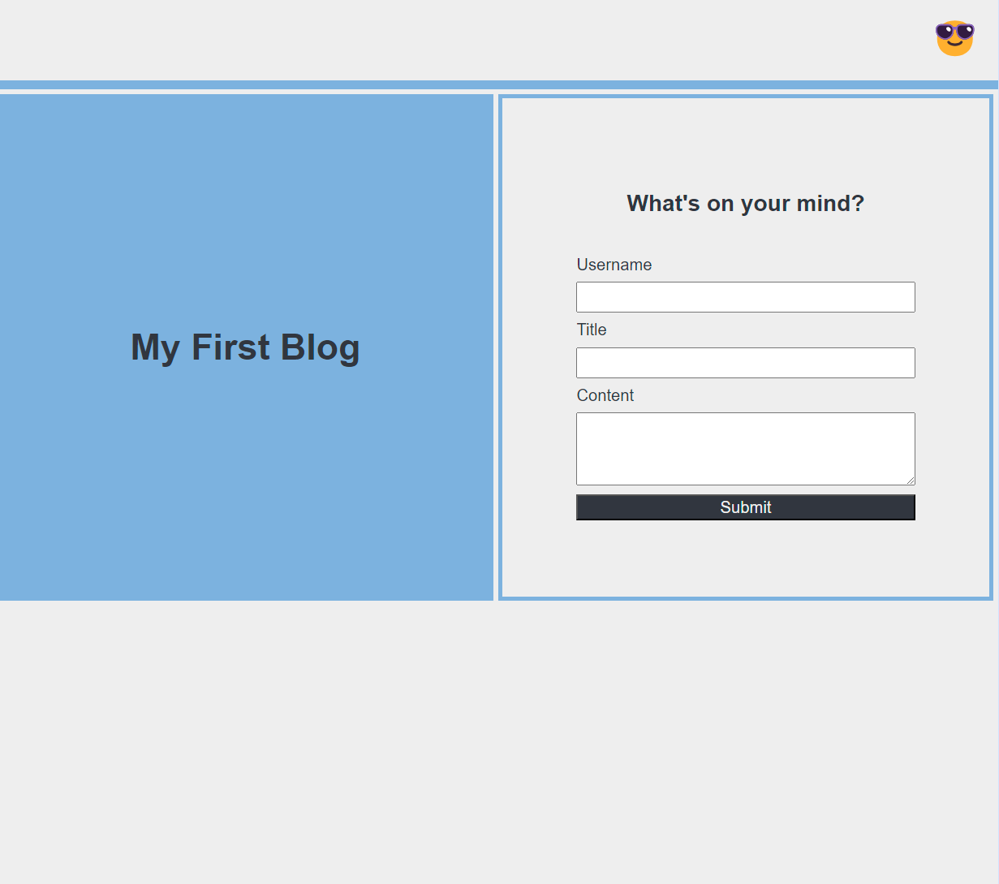
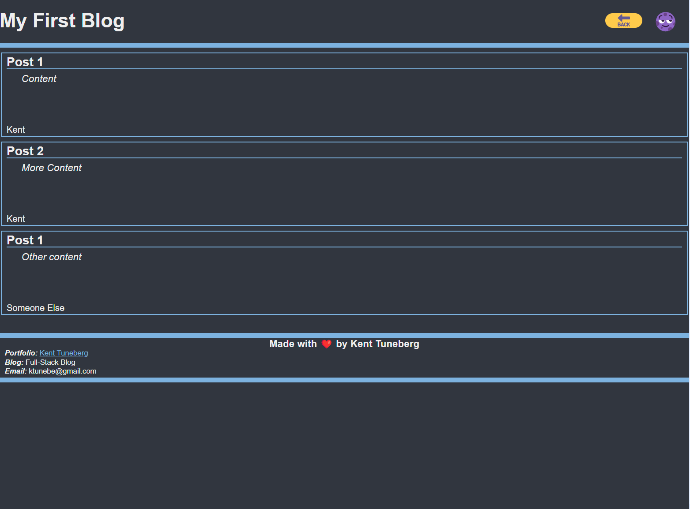

# challenge-04-personal-blog

## Description

This is a project for UW bootcamp in which we create our own blog page. Using local storage, we store blog posts and append them as they are added into a form. There is also a light/dark mode toggle that will change the styling of the pages.

## Installation

N/A

## Usage

On filling out a blog post, the user's name, title and post content will be entered into local storage and the user will be taken to a page with all previously saved posts. If the form is not completely filled out, an error message will appear. The sun/moon in the header of the pages will toggle the site between light and dark mode, and the current mode will also be saved into local storage between the two pages.

Link to deployed application: https://ktunebe.github.io/challenge-04-personal-blog/

## Credits

N/A

## License

N/A